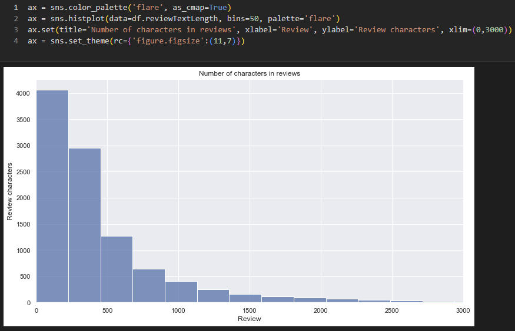

# Amazon Musical Instruments Ratings Data Analysis

Natural Language Processing: A comparison of AI models on the Amazon Musical Instruments Dataset. Our team analysed the Amazon Musical Instruments Dataset provided by Julian McAuley of the University of California San Diego (UCSD), with 10261 reviews, ranging from 2004 to 2014.

The purpose of the project is to understand which NLP and AI models work for the dataset best, and the use of the models.

We use a host of python packages including: pandas, numpy, seaborn (beautiful plots), NLTK, scikit-learn, Gensim, and spaCy.

In all, the project compares VADR, SentiWordNet, Logistic Regression, SVM (different kernels). Naive Bayes, Gradient Boosting, and then a further refinement of hyperparameters to get the best model, with roughly 60% accuracy, precision, and recall. We further test a popular package XGBoost, which preduced even higher averages.

If this analysis is taken further, a system setup to account for even more sentiment in each submitted piece of text, along with a rating for the users review qualities could further enhance the analysis.

Project on: [Kaggle](https://www.kaggle.com/code/gordonstevens/amazon-musical-instruments-ratings-data-analysis) / [GitHub](https://github.com/gordonstevens/amazon-musical-instruments-ratings-data-analysis) / [LinkedIn](https://www.linkedin.com/in/gordonstevens/)

Screenshots:

- Dataset Attribution and Information:

- Number of ratings given by year

- Number of ratings given by month

- Number of characters in reviews

- Vectorization

- Word Tags

- Grid Search for the Best Model

- All Results

- Preparing the Dataframe for further processing

- Project Report: Part 9 Modeling with Sentiment Analysis (Machine Learning Approach)

- Project Report: Part 4 Modeling with Sentiment Analysis (Lexicon Approach

- Project Report: Number of characters in reviews

